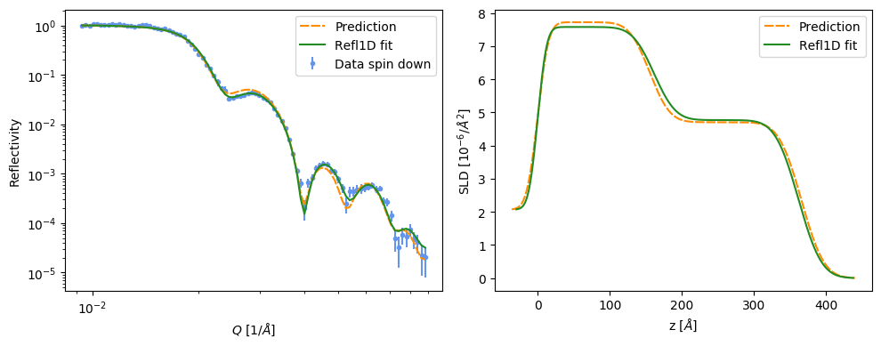

# Machine Learning for Reflectometry
M. Doucet, R. Archibald, W. Heller

Machine learning code to determine a thin film structure from a 
two-layer thin film measured with neutron reflectometry.

From an R(Q) profile with a predefined Q binning, we predict the values
of the two layer thicknesses, their SLD, their roughness parameters, and
the substrate's roughness.

## What's in the repo?
The `data` directory contains the two reflectivity data sets measured at the Magnetism Reflectometer at ORNL.

The `data/training_data` directory includes the neural network model. 

  * `haynes.h5` and `haynes.json` are TensorFlow files describing the trained model.
  * `haynes_q_values.npy` contains the Q points used in the input layer.
  * `haynes_history.json` contains the loss value as a function of epoch for the trained model.
  * `haynes_pars.npy` contains the structure parameters for the training set.
  * Because the R(Q) data of the training set is too large, it wasn't included in the repo but can be computed from the structure parameters.

The `notebooks` directory contains example notebooks that loads and
uses the trained neural network.

## Dependencies
TensorFlow was used to handle the neural network. A conda environment
can easily be created using the `play_env.yaml` file using

    conda env create -f play_env.yml
